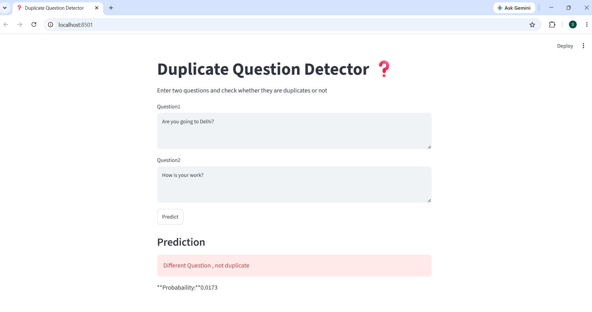
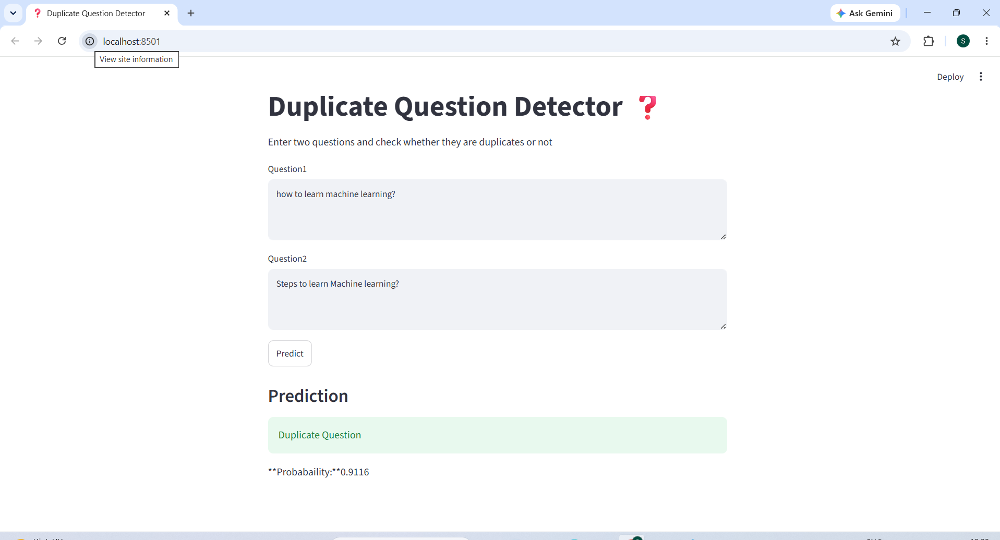

# 🔍 Duplicate Question Predictor (Quora Question Pairs)


🚀 An end-to-end NLP system to detect semantically similar questions using **Machine Learning + Deep Learning + Streamlit UI**.

---

## 📋 Table of Contents

1. [Overview](#1-overview)
2. [Problem Statement](#2-problem-statement)
3. [System Architecture](#3-system-architecture)
4. [Dataset](#4-dataset)
5. [Features](#5-features)
6. [Tech Stack](#6-tech-stack)
7. [Project Structure](#7-project-structure)
8. [Installation](#8-installation)
9. [How to Run](#9-how-to-run)
10. [Usage](#10-usage)
11. [Model Evaluation](#11-model-evaluation)
12. [Sample Output](#12-sample-output)
13. [UI Preview](#13-ui-preview)
14. [Future Improvements](#14-future-improvements)
15. [Skills Demonstrated](#15-skills-demonstrated)
16. [Author](#16-author)

---

## 1. Overview

The **Duplicate Question Predictor** is a machine learning and deep learning-based system designed to identify whether two questions are semantically similar or duplicates, even if they are worded differently.

**Example:**
| Question 1 | Question 2 | Same Intent? |
|---|---|---|
| "Steps to learn Machine Learning" | "How to learn Machine Learning" | ✅ Yes |

Traditional keyword-based systems treat these as different questions. This project solves that problem using NLP, ML, and DL techniques to detect semantic similarity and prevent duplicate content issues ,completed with a **Streamlit web app** for real-time predictions.

---

## 2. Problem Statement

On platforms like Quora, StackOverflow, or other Q&A forums, users often ask the same question using different wording. This leads to:

- ❌ Duplicate content
- ❌ Fragmented answers across multiple threads
- ❌ Poor user experience
- ❌ Reduced knowledge efficiency

**Goal:** Build a system that can accurately detect whether two questions are duplicates or not ,even if phrased differently.

---

## 3. System Architecture

### 🔄 General Pipeline

```
User Input (Question Pair)
        ↓
Text Preprocessing (Cleaning, Tokenization)
        ↓
Feature Engineering (TF-IDF / Numerical Features)
        ↓
Model Selection (ML / DL Models)
        ↓
Prediction Layer
        ↓
Streamlit UI Output
```

### 🧠 Deep Learning Pipeline

```
Question 1 + Question 2
        ↓
Embedding Layer
        ↓
RNN / LSTM / BiLSTM / Siamese / Hybrid Model
        ↓
Dense Layers
        ↓
Sigmoid Output (Duplicate / Not Duplicate)
```

---

## 4. Dataset ⭐

| Detail | Info |
|---|---|
| **Dataset** | Quora Question Pairs |
| **Source** | [Kaggle – Quora Question Pairs](https://www.kaggle.com/c/quora-question-pairs) |
| **Full Size** | ~400,000+ rows |
| **Used Subset** | 70,000 rows |

### Dataset Columns
- `id`
- `qid1`
- `qid2`
- `question1`
- `question2`
- `is_duplicate` *(target variable: 1 = Duplicate, 0 = Not Duplicate)*

---

## 5. Features

### 📝 Text-Based Features
- TF-IDF vectors
- Word-level similarity features
- Token overlap
- Cosine similarity (implicit via vectorization)

### 🔢 Numerical Features
- Length difference between questions
- Common word count
- Fuzzy matching features

---

## 6. Tech Stack

| Category | Tools |
|---|---|
| **Language** | Python |
| **Data Handling** | Pandas, NumPy |
| **Machine Learning** | Scikit-learn, XGBoost |
| **Deep Learning** | TensorFlow / Keras |
| **NLP Utilities** | NLTK, Regex |
| **Web App** | Streamlit |
| **Visualization** | Matplotlib, Seaborn |

---

## 7. Project Structure

```text
duplicate-question-detector/
│
├── data/
│   ├── raw/
│   └── processed/
│
├── notebooks/
│   ├── 01_eda.ipynb
│   ├── 02_preprocessing_and_features.ipynb
│   ├── 03_ml_model.ipynb
│   ├── 04_dl_model.ipynb
│   ├── 05_dl_with_features.ipynb
│   └── model_results.csv
│
├── src/
│   ├── predict.py
│   ├── preprocessing.py
│   └── feature_engineering.py
│
├── models/
│
├── assets/
│   ├── demo1.png
│   └── demo2.png
│
├── app.py
├── requirements.txt
└── README.md
```

---

## 8. Installation

**1. Clone the repository**
```bash
git clone https://github.com/Samarth041/Duplicate-Question-Predictor-in-Quora
cd Duplicate-Question-Predictor-in-Quora
```

**2. Create a virtual environment**
```bash
python -m venv venv
```

**3. Activate the environment**
```bash
# Windows
venv\Scripts\activate

# macOS/Linux
source venv/bin/activate
```

**4. Install dependencies**
```bash
pip install -r requirements.txt
```

---

## 9. How to Run

### 🧪 Train Models (Optional)

Run notebooks in the following order:

1. `01_eda.ipynb`
2. `02_preprocessing_and_features.ipynb`
3. `03_ml_model.ipynb`
4. `04_dl_model.ipynb`
5. `05_dl_with_features.ipynb`

### ▶️ Run the Streamlit App

```bash
streamlit run app.py
```

---

## 10. Usage

1. Open the Streamlit UI
2. Enter **Question 1**
3. Enter **Question 2**
4. Click **Predict**
5. View the result:
   - ✅ **Duplicate**
   - ❌ **Not Duplicate**

---

## 11. Model Evaluation

### 🤖 Machine Learning Models

| Model | Feature | Accuracy | Precision | Recall | F1 Score |
|---|---|---|---|---|---|
| Logistic Regression | TF-IDF | 0.6871 | 0.6637 | 0.7586 | 0.7080 |
| Random Forest | TF-IDF | 0.7431 | 0.7048 | 0.8363 | 0.7650 |
| XGBoost | TF-IDF | 0.7528 | 0.7011 | 0.8813 | 0.7810 |

### 🧠 Deep Learning Models

| Model | Approach | Accuracy | Precision | Recall | F1 Score |
|---|---|---|---|---|---|
| Simple RNN | DL | 0.5223 | 0.5145 | 0.7892 | 0.6229 |
| LSTM | DL | 0.7212 | 0.7411 | 0.6798 | 0.7091 |
| BiLSTM | DL | 0.7224 | 0.7450 | 0.6763 | 0.7090 |
| Siamese Network | DL | 0.7097 | 0.6943 | 0.7495 | 0.7208 |
| **Hybrid LSTM + Dense** | DL | **0.7889** | **0.7917** | **0.7928** | **0.7922** |

> 🏆 **Best Performing Model:** Hybrid LSTM + Dense — achieving the highest balance across all metrics.

---

## 12. Sample Output

### Example 1
| Field | Value |
|---|---|
| Question 1 | What is Machine Learning? |
| Question 2 | How does Machine Learning work? |
| **Prediction** | ✅ Duplicate |
| **Probability** | 0.87 |

### Example 2
| Field | Value |
|---|---|
| Question 1 | What is Python? |
| Question 2 | How to cook pasta? |
| **Prediction** | ❌ Not Duplicate |
| **Probability** | 0.03 |

---

## 13. UI Preview

### Demo 1


### Demo 2


---

## 14. Future Improvements

- 🔮 Use Transformer models (BERT, RoBERTa)
- 🧬 Improve semantic embeddings (Sentence-BERT)
- ☁️ Deploy on cloud (AWS / Azure / GCP)
- ⚡ Add API layer using FastAPI
- 📊 Improve feature engineering with semantic similarity scores
- 🚀 Real-time scalable deployment

---

## 15. Skills Demonstrated

- Natural Language Processing (NLP)
- Machine Learning (Logistic Regression, Random Forest, XGBoost)
- Deep Learning (LSTM, BiLSTM, Siamese Networks)
- Feature Engineering
- Model Evaluation & Optimization
- Data Preprocessing & EDA
- Streamlit Web App Development
- End-to-End ML System Design

---

## 16. Author

**Samarth Gupta**

Machine Learning & Deep Learning Enthusiast
Focus: NLP, Real-world AI Systems, Model Deployment

🔗 [GitHub Repository](https://github.com/Samarth041/Duplicate-Question-Predictor-in-Quora)
